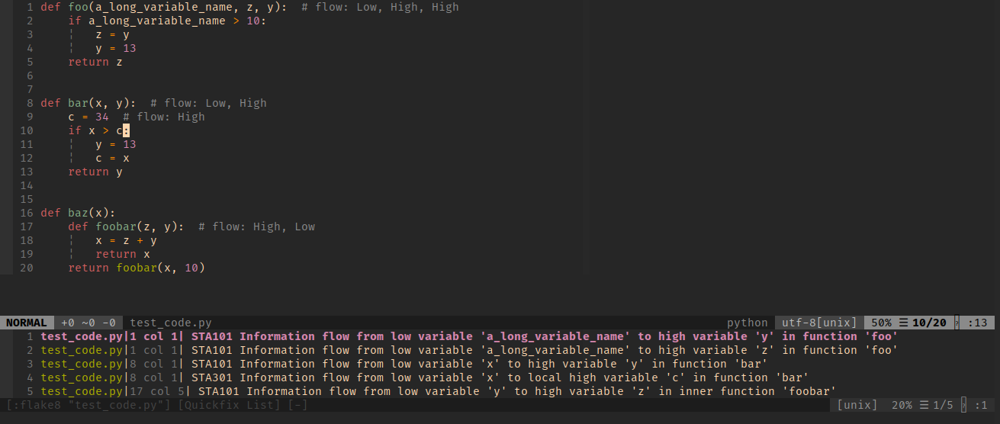

# Static information flow analysis for Flake8

## What is this ?

The goal of this project was to create a plugin for Flake8 to statically analyse
your code and find dependencies between variables deemed _confidential_ or
_inconfidential_ (high/low in terms of security classes) by the user.

In the following code for example, we don't want any information about the
variable `high` to be leaked to the public. We furthermore have a variable `low`
that is available to the public. Note, that for Python specifically, this may
be less feasible as the inspection of variables is far easier than it is for
compiled languages like C. 

```
def foo(high, low): # flow: High, Low
    if high > 10:
        low = 10
    else:
        low = 0
    return low
```

(Note that for now that analysis only works on function parameters. Flow
specifications could also be added to local variables in the future)

Since high is a high confidentiality variable, we assume that the public does
not know anything about this variable. In the example function however, we have
an interaction between a publically accessible variable and a confidential
variable. The public variable is modified depending on the context of the
confidential variable and thus leaks information about the confidential
variable.

Using Static Flow Analysis, we can determine that in fact, there is an
information flow from a high to a low variable anbd display it as a Flake8
error.

## Disclaimer

As Static Information Flow Analysis may not be that useful in Python due to
inspection being easy, this could still be extended to work on ASTs for other
languages, e.g. C (check out the [pycparser project](https://github.com/eliben/pycparser)).
This however is just a simple demonstration of Static Information Flow Analysis
based on a so called _Hoare-Logic_. For fun, I added a binding to flake8 such
that we can also display the results in an IDE using this linter.

# Installation and Usage

To install this plugin just clone the repo and run these commands:

```
pip install -r requirements.txt
pip install .
```

After that the plugin should be installed warnings be reported inside _flake8_
To test whether it works, run

```
flake8 test_code.py 
```

and you should see an output like this:

```
test_code.py:1:1: STA101 Information flow from low variable 'a_long_variable_name' to high variable 'y' in function 'fo
o'
test_code.py:1:1: STA101 Information flow from low variable 'a_long_variable_name' to high variable 'z' in function 'fo
o'
test_code.py:8:1: STA301 Information flow from low variable 'x' to local high variable 'c' in function 'bar'
test_code.py:8:1: STA101 Information flow from low variable 'x' to high variable 'y' in function 'bar'
test_code.py:17:5: STA101 Information flow from low variable 'y' to high variable 'z' in inner function 'foobar'
```

If you see this the installation was successful and you can use this inside your
favourite IDE/text editor.



# The Theory

## Hoare Logic

Without going into too much detail, Hoare logic is basically nothing else than a
set of rules that allows to make certain statements about the correctness of a
programme. The main concept here is that of a so called _Hoare triple_
consisting of a _pre-condition $\{P\}$_, a _command_ $\{C\}$ and a post-condition
$\{Q\}$ that holds after execution of the command in a state that satisfies the
pre-condition. (_**reference needed**_)

How is this useful for Static Information Flow Analysis ? 

We define a set of rules, one for each statement we want to analyse (e.g.
`while` loops, assignments, or `if` statements), that specify how a set of
so-called _independences_ (the pre-condition) is modified (the post-condition) under a statement (the
command).
These rules can then be used in the analysis phase to compute the postconditions
while traversing the **AST**.

The exact nature of these rules will not be discussed here and the interested
reader can look them up in the references down below.

## Independences 

As already mentioned above, the analysis revolves around the concept of
_independences_. A set of independences $\{[x\#y,z], [y\#x]\}$ simply states
that the **current value** of the variable $x$ is _independent_ of the **initial** value of both $y$ and
$z$ and similarly the **current value** of the variable $y$ is _independent_ of
the **initial** value of $x$.

After visiting a statement we can infer from the set of rules that we formed how
these independences changed.

For example after analysing the assignment $x = y$ we can deduce that $x$ is now
indepent of everything that $y$ is independent of and our new set of
independencies becomes $\{[x\#x], [y\#x]\}$.

## Context

The final concept is that of the context. A context encapsulates _implicit
dependencies_, i.e. dependencies that are imposed by the flow of the programme.
More specifically this occurs whenever we encounter a conditional loop or `if`
statement. 

Take for example 
```
if x < 5:
    y = 10
else:
    y = 5
```

The value of $y$ is implicitally dependent on the initial value of $x$ since it
is changed to 10 or 5 depending on the value of $x$.

## Limitations

There are some limitations for this implementation that could be solved by a
more sophisticated implementation.

One of these limitations is the following case:

```
if x < 5:
    y = 10
else:
    y = 10
```

Obviously, $y$ is not dependent on $x$ here as it is always assigned the same
value but the analysis is not able to capture that and will raise an error.

Another case is 
```
x = y - y
```

Again, x is obviously not dependent on the initial value of y since it is always
0 but the implementation is not quite able to grasp that. A solution would be to
implement the _strongest semantic postcondition_ which is able to resolve this
issue.

# Implementation


# References
